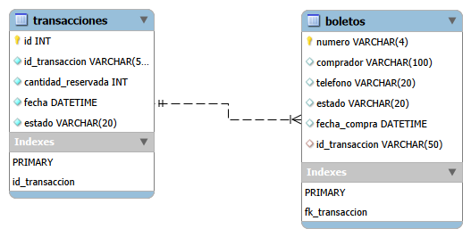

# 📘 Modelo Entidad‑Relación - Sistema de Rifa

## 1. Introducción
Este documento describe el modelo entidad‑relación actual del sistema de rifa.  
El objetivo es representar gráficamente las entidades principales, sus atributos y las relaciones entre ellas, garantizando integridad y consistencia de los datos.

## 2. Entidades principales
- **Boletos**: registro de cada boleto con su estado y comprador.  
- **Transacciones**: control de reservas y compras realizadas.

## 3. Atributos de las entidades
### Tabla: boletos
- **numero** (PK) → Identificador único del boleto.  
- **comprador** → Nombre del comprador.  
- **telefono** → Teléfono de contacto.  
- **estado** → Estado del boleto (Disponible, Vendido, Reservado).  
- **fecha_compra** → Fecha en que se realizó la compra.  
- **id_transaccion** (FK) → Relación con la transacción correspondiente.

### Tabla: transacciones
- **id** (PK) → Identificador interno de la transacción.  
- **id_transaccion** (UNIQUE) → Código único de la transacción.  
- **cantidad_reservada** → Número de boletos reservados.  
- **fecha** → Fecha de la transacción.  
- **estado** → Estado de la transacción (Activa, Cancelada, Finalizada).

## 4. Relaciones
- Una **transacción** puede tener varios **boletos**.  
- Cada **boleto** pertenece a una única **transacción**.  
- Relación: `boletos.id_transaccion → transacciones.id_transaccion`.

## 5. Diagrama

## 6. Observaciones
- El modelo refleja la versión actual en producción.  
- La clave primaria de `boletos` es el número del boleto.  
- La integridad referencial se asegura mediante la FK `id_transaccion`.

## 7. Mejoras futuras
- Normalizar nombres de columnas para consistencia.  
- Implementar `ON DELETE CASCADE` en relaciones.  
- Agregar campos de trazabilidad (usuario responsable, método de pago).
