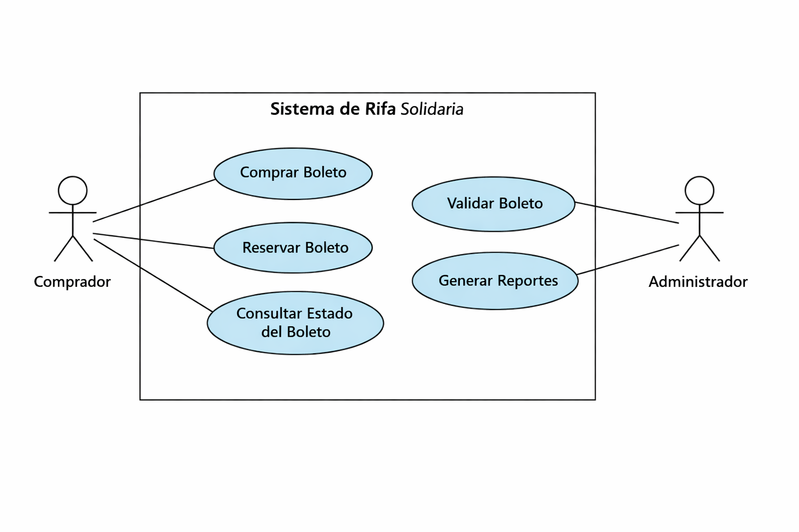

# 📘 Casos de Uso - Sistema de Rifa

## 1. Introducción
Este documento describe los principales casos de uso del sistema de rifa, basados en la interacción de los actores con el sistema.  
Se utiliza la notación UML como referencia para estructurar los escenarios.

---

## CU01 - Comprar boleto
**Actor:** Comprador  
**Objetivo:** Adquirir un boleto válido para participar en la rifa.  
**Precondiciones:**  
- El boleto debe estar en estado "Disponible".  
- El comprador debe proporcionar datos de contacto.  

**Flujo principal:**  
1. El comprador selecciona un boleto disponible.  
2. El sistema valida disponibilidad.  
3. El sistema registra la compra en la tabla `boletos`.  
4. El sistema genera una transacción en la tabla `transacciones`.  
5. El sistema confirma la compra y muestra comprobante.  

**Flujos alternativos:**  
- Si el boleto ya está vendido, el sistema muestra mensaje de error.  
- Si falta información del comprador, el sistema solicita completar los datos.  

**Postcondiciones:**  
- El boleto queda marcado como "Vendido".  
- El boleto se asocia a la transacción correspondiente.  

---

## CU02 - Reservar boleto
**Actor:** Comprador  
**Objetivo:** Reservar un boleto para compra futura.  
**Precondiciones:**  
- El boleto debe estar en estado "Disponible".  

**Flujo principal:**  
1. El comprador selecciona un boleto disponible.  
2. El sistema marca el boleto como "Reservado".  
3. El sistema registra la reserva en la tabla `transacciones`.  
4. El sistema confirma la reserva al comprador.  

**Flujos alternativos:**  
- Si el boleto ya está reservado o vendido, el sistema muestra mensaje de error.  

**Postcondiciones:**  
- El boleto queda marcado como "Reservado".  
- El boleto se asocia a la transacción de reserva.  

---

## CU03 - Validar boleto
**Actor:** Administrador  
**Objetivo:** Confirmar que un boleto es válido para la rifa.  
**Precondiciones:**  
- El boleto debe existir en la base de datos.  

**Flujo principal:**  
1. El administrador ingresa el número de boleto.  
2. El sistema busca el boleto en la tabla `boletos`.  
3. El sistema verifica estado y transacción asociada.  
4. El sistema confirma validez del boleto.  

**Flujos alternativos:**  
- Si el boleto no existe, el sistema muestra mensaje de error.  
- Si el boleto está en estado "Reservado", se indica que aún no es válido para participar.  

**Postcondiciones:**  
- El administrador obtiene confirmación de validez o invalidez del boleto.  

## Diagrama UML de Casos de Uso
El siguiente diagrama representa las interacciones entre los actores y el sistema de rifa solidaria, conforme al estándar UML.

    