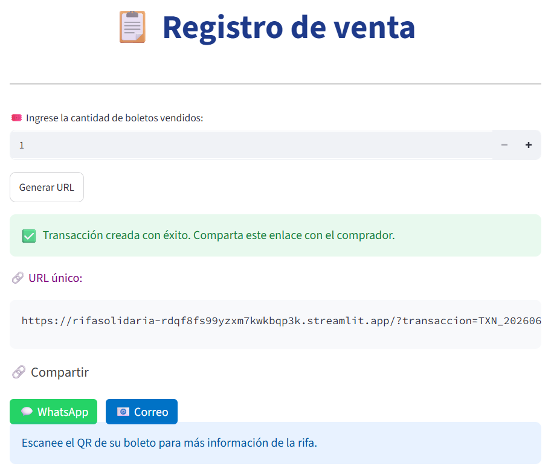
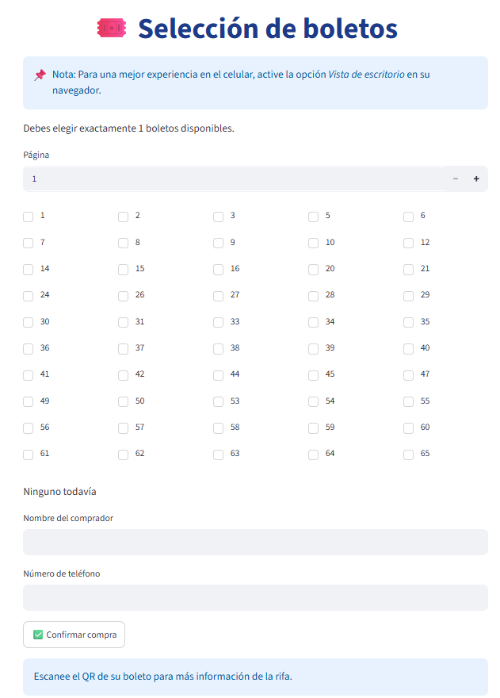
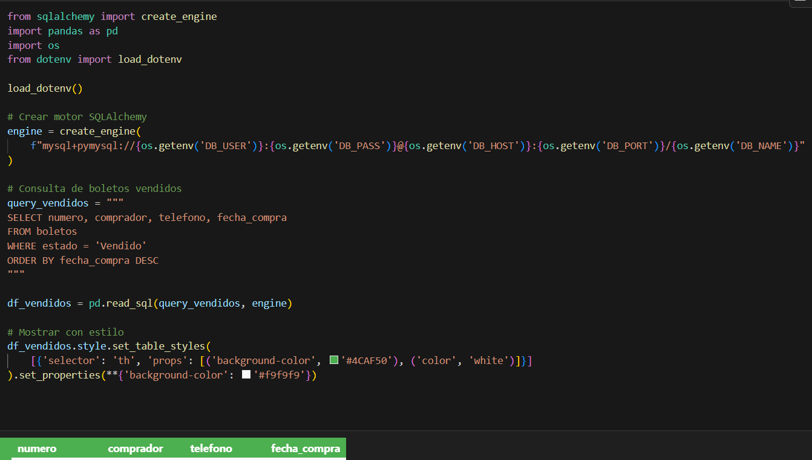
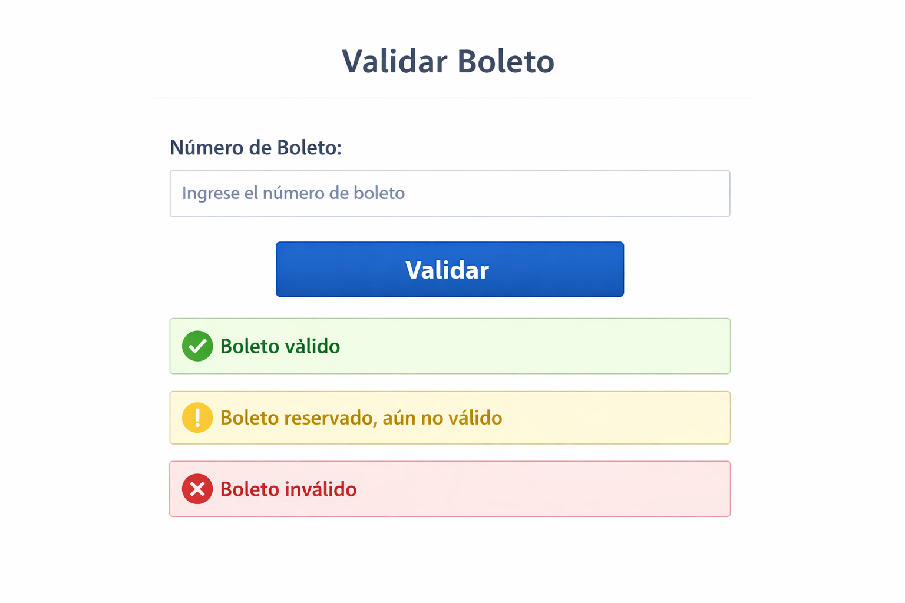

# 📘 Mockups - Sistema de Rifa

## 1. Introducción
Este documento presenta los mockups (prototipos visuales) de las principales pantallas del sistema de rifa.  
Los mockups permiten visualizar la interfaz de usuario antes de su implementación, asegurando que cumpla con los requerimientos funcionales y las expectativas de los actores.

---

## 2. Pantallas principales

### Mockup 1: Formulario de reserva de boleto
- **Actor:** Comprador  
- **Objetivo:** Reservar un boleto para compra futura.  
- **Elementos visuales:**  
  - Campo para ingresar número de boletos vendidos.  
  - Botón “Generar URL”.  
  - Mensaje de confirmación de reserva.
  - Link que direcciona al formulario de compra de boleto.

---

### Mockup 2: Formulario de compra de boleto
- **Actor:** Comprador  
- **Objetivo:** Adquirir un boleto disponible.  
- **Elementos visuales:**  
  - Campo para número de boleto.  
  - Campos de datos del comprador (nombre, teléfono).  
  - Botón “Confirmar Compra”.  
  - Mensaje de confirmación.  

---

### Mockup 3: Validación de boleto
- **Actor:** Administrador  
- **Objetivo:** Validar si un boleto es válido para la rifa.  
- **Elementos visuales:**  
  - Campo para ingresar número de boleto.  
  - Botón “Validar”.  
  - Mensaje de resultado (válido / no válido).  

> 📝 **Nota:** La funcionalidad de validación de boletos aún no está implementada en el sistema actual.  
> Se encuentra planificada para una futura versión del módulo de administración, donde el encargado podrá verificar la validez de los boletos directamente desde la interfaz.
---

### Mockup 4: Reportes
- **Actor:** Administrador  
- **Objetivo:** Generar reportes de boletos vendidos, reservados y disponibles.  
- **Elementos visuales:**  
  - Tabla con listado de boletos.  
  - Filtros por estado.  
  - Botón “Exportar PDF/Excel”.  
  - Visualización de datos con estilo (colores y encabezados).  

> 📝 **Nota:** Este mockup se basa en una vista generada desde Jupyter Notebook utilizando `pandas` y `SQLAlchemy`.  
> En futuras versiones, esta funcionalidad se integrará directamente en la interfaz del sistema (por ejemplo, en Streamlit o una aplicación web).
---

## 3. Observaciones
- Los mockups son representaciones visuales iniciales y pueden ajustarse durante el desarrollo.  
- Se recomienda mantener consistencia en colores, tipografía y estilo visual para transmitir profesionalismo.  
- Cada mockup está vinculado a un Caso de Uso y a uno o más Requerimientos Funcionales.  

